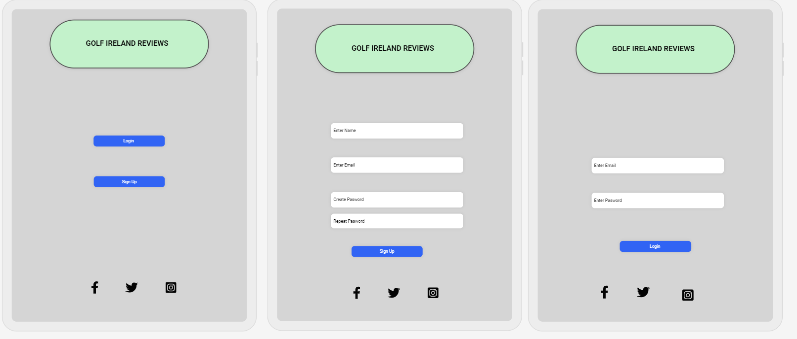
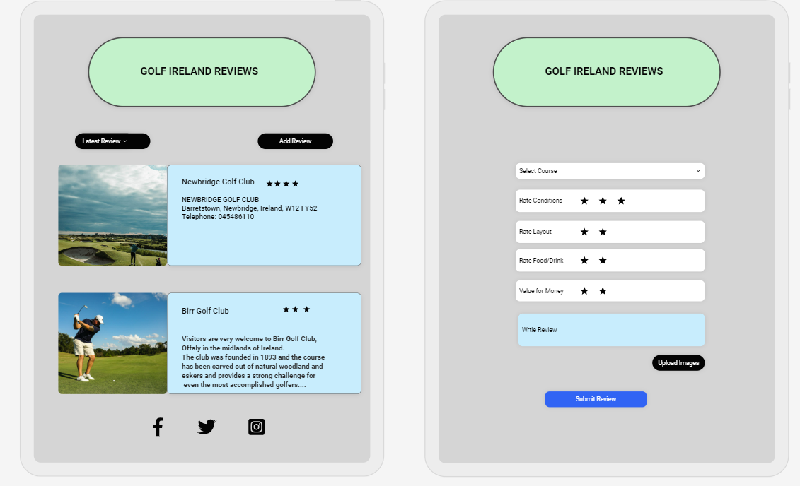
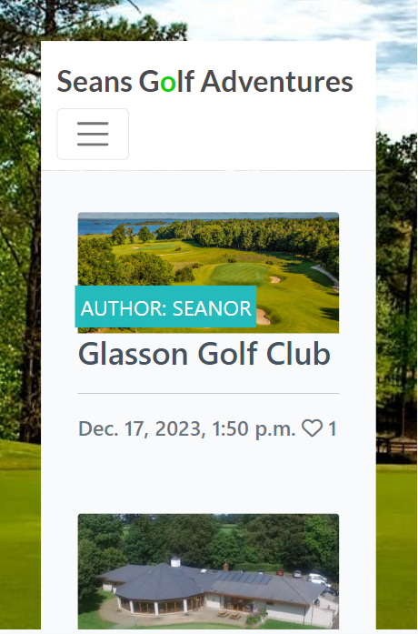
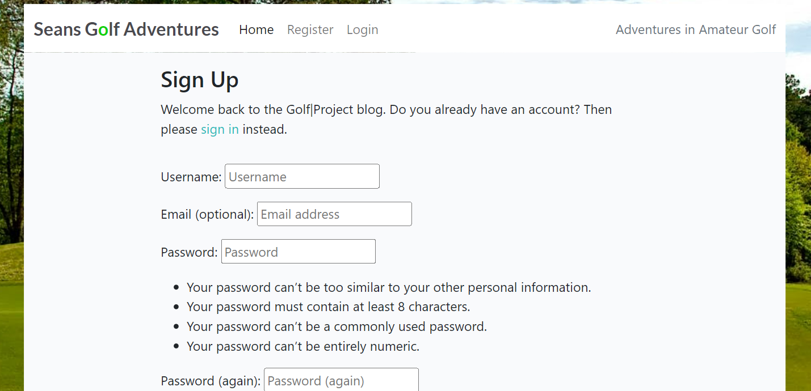
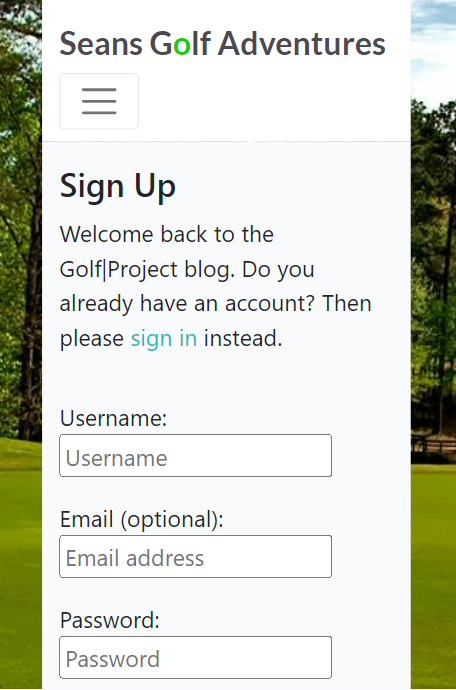
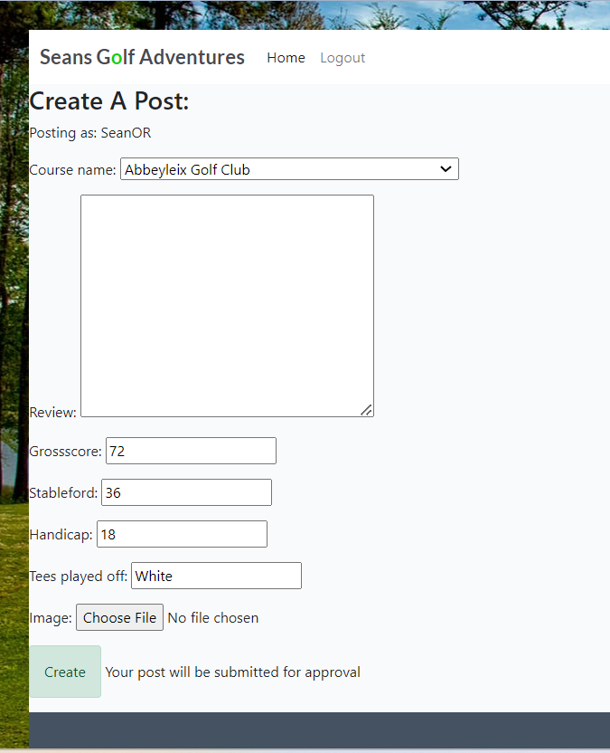
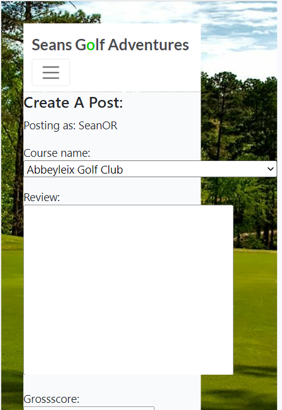
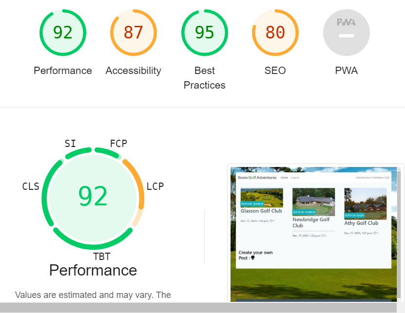

# Seans Golf Adventures

Seans Golf Adventures is a Blog about golf courses around Ireland. The idea is to post about your visit to a course and leave feedback. The models ask for specific information like the players handicap, tees played off and their score at the end of the round. The user as well as Admin can post to it but only Admin can approve posts to be published. It encourages interaction through inviting the user to comment and like other peoples posts and to even submit a post themselves.

The live link can be found here: 
[Live Site - Seans Golf Adventures](https://projectgolf-537a6c2d3f19.herokuapp.com/)

## CONTENTS

- [Seans Golf Adventures](#seans-golf-adventures)
  - [CONTENTS](#contents)
  - [User Experience (UX)](#user-experience-ux)
    - [User Stories](#user-stories)
  - [Design](#design)
    - [Colour Scheme](#colour-scheme)
    - [Imagery](#imagery)
    - [Wireframes](#wireframes)
  - [Features](#features)
    - [General features on each page](#general-features-on-each-page)
    - [Future Implementations](#future-implementations)
    - [Accessibility](#accessibility)
  - [Technologies Used](#technologies-used)
    - [Languages Used](#languages-used)
    - [Deployment](#deployment)
      - [How to Fork](#how-to-fork)
      - [How to Clone](#how-to-clone)
  - [Testing](#testing)
  - [Bugs](#bugs)
  - [Credits](#credits)
    - [Content](#content)
    - [Media](#media)
    - [Acknowledgments](#acknowledgments)

---

## User Experience (UX)

### User Stories

First time visitors will be greeted with a well layed out and interesting website. The most recent 6 blog posts will be visible on the home page and then a simple navigation tool allows further browsing. Each blog post will have a picture either uploaded by the author or by default. 

Upon registering user will be able to like and comment on posts and even submit their own posts to the blog. All comments and blog posts will be approved by Admin. 

## Design

### Colour Scheme

The colour scheme is based on the background image of a golf course with each blog post photo sitting over this image. If there isn't a picture uploaded with the post a default image of a golf course will be provided. 
The background is white and the text overlay is black giving simple but effective contrast. The Footer is the opposite with a dark background contrasting with light colored text. 

### Imagery

Images used are a selection of golf course images from pexels.com. If the post author doesn't include an image a default image of a golf course will show in it's place. 

### Wireframes

I drew out a very simple wireframes with Uizard.

## Features

This site contains a home page with bog posts paginated by 6 with easy to navigate controls to reach more posts. 
Users can register and log in to comment and like posts as well as submit their own posts. 

### General features on each page

There is a header and footer that are used across the site using django block content. 
The user can navigate to the log in/logout/register page by clicking the burger icon on small screens or the login/logout/signup button on larger screens.
The site logo "Seans Golf Adventures" also links to the home page.  
Once logged in a user can create their own post by clicking on the Create Post button at the bottom of the home page. 
The link in the footer leads to the creaters github profile. 

### Future Implementations

I would like to add the ability to rate each course with stars. So each user can rate out of 5 stars their experience of each course.

### Accessibility

All images and links used have aria labels and lighthouse scores the site above 90%. 

## Technologies Used

ElephantSQL - for the database.

Cloudinary - for image hosting. 

Github - To save and store the files for the website.

Codeanywhere - to write the code.

Google Fonts - To import the fonts used on the website.

Crispy Alerts - for the alert boxes.

Google Dev Tools - To troubleshoot and test features, solve issues with responsiveness and styling.

Mockflow for the wireframe.

### Languages Used

Python, Django, HTML, CSS & JavaScript.

### Deployment

Deployment

Github Pages was used to deploy the live website. The instructions to achieve this are below:

Log in (or sign up) to Github.
Find the repository for this project, seanorourke7/ProjectGolf.
Click on the Settings link.
Click on the Pages link in the left hand side navigation bar.
In the Source section, choose main from the drop down select branch menu. Select Root from the drop down select folder menu.
Click Save. Your live Github Pages site is now deployed at the URL shown.

#### How to Fork

How to Fork
To fork the RPSLS repository:

Log in (or sign up) to Github.
Go to the repository for this project, seanorourke7/ProjectGolf.
Click the Fork button in the top right corner.

#### How to Clone

How to Clone
To clone the ProjectGolf repository:

Log in (or sign up) to GitHub.
Go to the repository for this project, seanorourke7/ProjectGolf.
Click on the code button, select whether you would like to clone with HTTPS, SSH or GitHub CLI and copy the link shown.
Open the terminal in your code editor and change the current working directory to the location you want to use for the cloned directory.
Type 'git clone' into the terminal and then paste the link you copied in step 3. Press enter.

## Testing

Testing was ongoing throughout the entire build using dev tools and running tests in the terminal window. 

## Bugs

There is currently a bug in that the slug of each post is the id of the post which is unique to each post. This allows multiple posts/reviews of the same golf course. However when the post is submitted for approval the slug is set to none in the Admin page and when it's approved the id needs to be manually entered into the slug field. This should be automatic. 

The signup page is failing the W3C validator but as it's a direct import from Django I can't edit it. 

## Credits

### Content

The site was written by me and is for educational purposes only.

### Media

### Acknowledgments

And the Slack community for this project is a great help for community discorse and feedback.

<https://seanorourke7.github.io/ProjectGolf>

---
