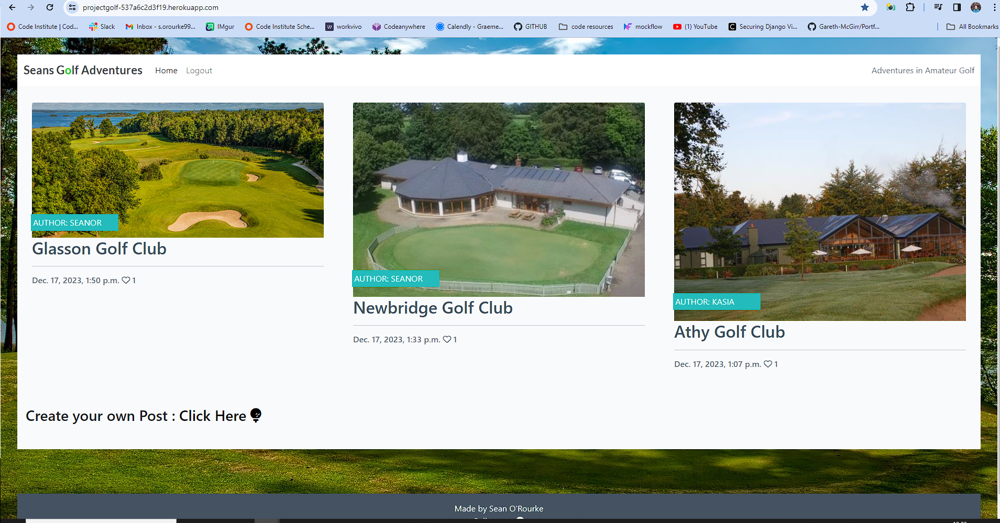

# Seans Golf Adventures

Seans Golf Adventures is a Blog about golf courses around Ireland. The idea is to post about your visit to a course and leave feedback. The models ask for specific information like the players handicap, tees played off and their score at the end of the round. The user as well as admin can post to it but only Admin can approve posts to be published. It encourages interaction through inviting the user to comment and like other peoples posts and to even submit a post themselves. 

The live link can be found here: [Live Site - Seans Golf Adventures](https://projectgolf-537a6c2d3f19.herokuapp.com/)

## Table of Contents

---

## CONTENTS

- [Seans Golf Adventures](#seans-golf-adventures)
  - [Table of Contents](#table-of-contents)
  - [CONTENTS](#contents)
  - [User Experience (UX)](#user-experience-ux)
    - [User Stories](#user-stories)
  - [Design](#design)
    - [Colour Scheme](#colour-scheme)
    - [Imagery](#imagery)
    - [Wireframes](#wireframes)
  - [Features](#features)
    - [General features on each page](#general-features-on-each-page)
    - [Future Implementations](#future-implementations)
    - [Accessibility](#accessibility)
  - [Technologies Used](#technologies-used)
    - [Languages Used](#languages-used)
    - [Deployment](#deployment)
      - [How to Fork](#how-to-fork)
      - [How to Clone](#how-to-clone)
  - [Testing](#testing)
  - [Bugs](#bugs)
  - [Credits](#credits)
    - [Content](#content)
    - [Media](#media)
    - [Acknowledgments](#acknowledgments)

---

## User Experience (UX)

### User Stories

First time visitors will

## Design

### Colour Scheme

The colour scheme is based on the background image of 

### Imagery

Images used are a selection of 

### Wireframes

I drew out a very simple wireframes with mockflow.

## Features

This site contains a home page with

### General features on each page

There is a header that is consitant across the site and in

### Future Implementations

I would like to add 

### Accessibility

All 

## Technologies Used

Github - To save and store the files for the website.

Codeanywhere - to write the code.

Google Fonts - To import the fonts used on the website.

Crispy Alerts - for the alert boxes.

Google Dev Tools - To troubleshoot and test features, solve issues with responsiveness and styling.

Tiny PNG To compress images.

Am I Responsive? To show the website image on a range of devices.

Mockflow for the wireframe.

### Languages Used

Python, Django, HTML, CSS & JavaScript.

### Deployment

Deployment

Github Pages was used to deploy the live website. The instructions to achieve this are below:

Log in (or sign up) to Github.
Find the repository for this project, seanorourke7/ProjectGolf.
Click on the Settings link.
Click on the Pages link in the left hand side navigation bar.
In the Source section, choose main from the drop down select branch menu. Select Root from the drop down select folder menu.
Click Save. Your live Github Pages site is now deployed at the URL shown.

#### How to Fork

How to Fork
To fork the RPSLS repository:

Log in (or sign up) to Github.
Go to the repository for this project, seanorourke7/ProjectGolf.
Click the Fork button in the top right corner.

#### How to Clone

How to Clone
To clone the ProjectGolf repository:

Log in (or sign up) to GitHub.
Go to the repository for this project, seanorourke7/ProjectGolf.
Click on the code button, select whether you would like to clone with HTTPS, SSH or GitHub CLI and copy the link shown.
Open the terminal in your code editor and change the current working directory to the location you want to use for the cloned directory.
Type 'git clone' into the terminal and then paste the link you copied in step 3. Press enter.

## Testing

Testing was ongoing throughout the entire build

## Bugs

## Credits

### Content

The site was written by me and is for educational purposes only.

### Media

### Acknowledgments

And the Slack community for this project is a great help for community discorse and feedback.

<https://seanorourke7.github.io/ProjectGolf>

---
