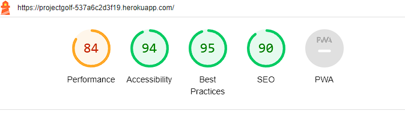
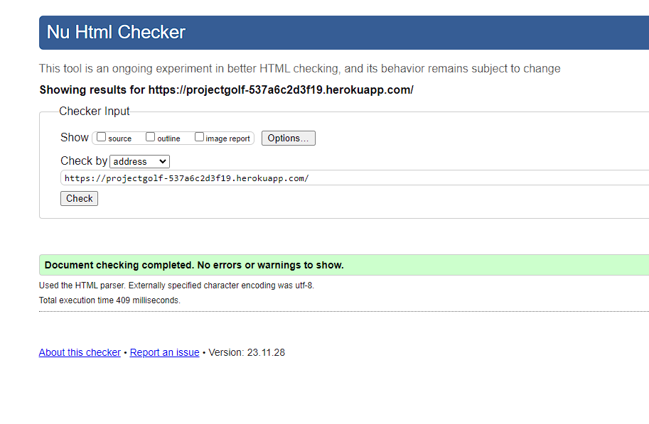
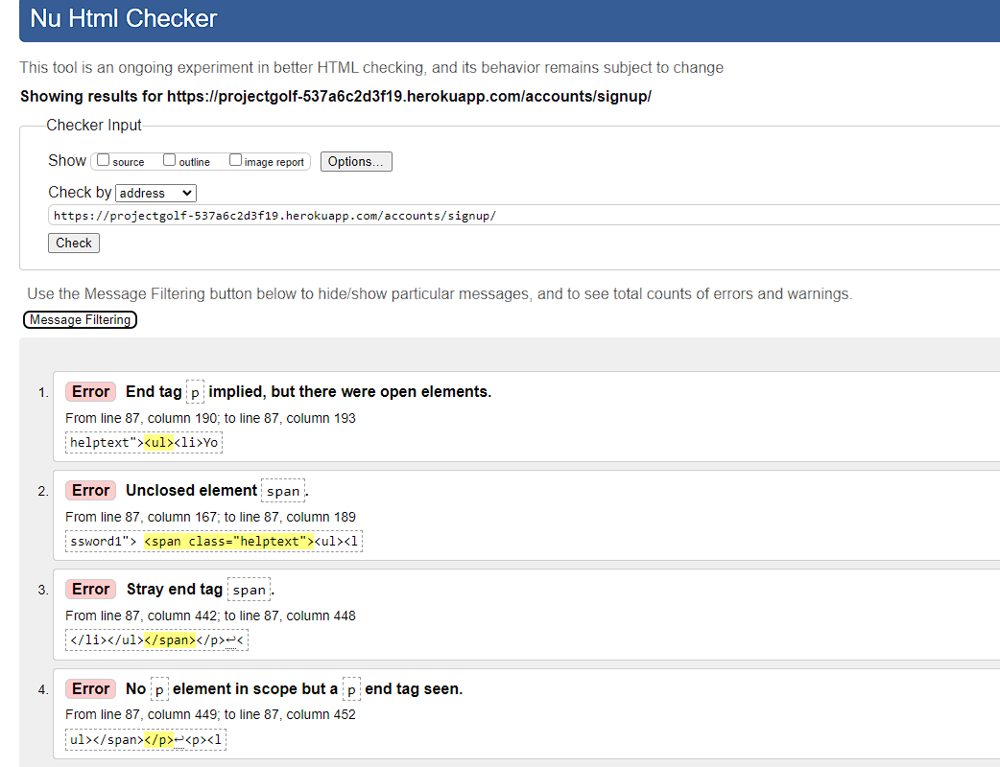

## Functional Testing

**Viewing Posts without an account**

Description:

Ensure visitors can only view posts and can't make any edits.

Once a user visits the site they should be able to view posts only. 

Steps:

Navigate to site and view the posts. Try to edit or comment/like without an account. 

Expected:

User should only be able to view the posts without loggin in.

Actual:

User can only view posts without logging in.

**Authentication**

Description:

Ensure a user can sign up to the website

Steps:

1. Navigate to [Seans Golf Project](https://projectgolf-537a6c2d3f19.herokuapp.com/) and click Register
2. Enter Username and password
3. Click Sign up

Expected:

Once user inputs a valid password and username an account is set up.

Actual:

As expected, User is registered once a valid username and password is entered.

Description:

Ensure a user can log in once signed up

Steps:

1. Navigate to [Seans GOlf Project](https://projectgolf-537a6c2d3f19.herokuapp.com/)
2. Enter login details created in previous test case
3. Click login

Expected:

User is successfully logged in and redirected to the home page

Actual:

User is successfully logged in and redirected to the home page

Description:

Ensure a user can sign out

Steps:

1. Login to the website
2. Click the logout button
3. Click confirm on the confirm logout page

Expected:

User is logged out

Actual:

User is logged out

**Commenting on / Liking a post**

Description:

Users, when logged in, can click on a post to see the detail of it and then click on the like heart emoji or leave a comment in the comment box or both. 

Expected: 

User is able to comment/like.

Actual:

User is able to comment/like.

**Create a Post**

Description:

Once logged in a User should be able to create their own post and submit to the blog.

Expected:

On clicking the create your own post link the user should be presented with a form to fill in to submit their own review.
The form should have a drop down menu for the list of courses and pre filled fields for scores, handicap, tee colours etc. 

Actual:

Users are directed to the form and when filled in the information is submitted successfully to the DB. 

**Edit a Post**

Description:

Once logged in a User should be able to edit their own post and submit to the blog.

Expected:

On viewing their own post the user should be presented with an option to edit. Once cliked the form should appear with the previously entered information visible.
The user can then edit the information and resubmit the form to the DB.

Actual:

Users are preseted with the previous form for editing and the edited information is submitted successfully to the DB.

**Delete a Post**

Description:

Once logged in a User should be able to delete their own post from the blog.

Expected:

On viewing their own post the user should be presented with an option to delete.
Once clicked the post is removed from the DB and the user is redirected to the homepage.

Actual:

Users are preseted with the delete button and when clicked the post is successfully deleted from the DB.

**Navigation Links**

Testing was performed to ensure all navigation links on the respective pages, navigated to the correct pages as per design. This was done by clicking on the navigation links on each page.

- Home -> index.html
- Logout -> logout.html
- Register -> signup.html
- Loging -> login.html
- Post Title Name -> post_detail.html
- Create your own post -> postcreate.html
- Delete post -> delete_post.html
- Edit post -> edit_post.html
- Follow Me -> <https://github.com/seanorourke7>

All navigation links directed to the corect pages as expected.

## Accessibility

Testing was focused to ensure the website is accessable to screen readers and passes w3c vaidator and lighthouse checks. 

## Validator Testing

All pages were run through the [w3 HTML Validator](https://validator.w3.org/). 

All pages pass the validator except the signup page from allauth. 

As this is an allauth file and not a file I can edit. I was unable to fix these errors. 

All pages were run through the code institute python linter [Pep8](https://pep8ci.herokuapp.com/) to ensure all code was pep8 compliant. Some errors were shown due to blank spacing and lines too long, 1 line instead of 2 expected. All of these errors were resolved and code passed through validators.

The django auto generated code for AUTH_PASSWORD_VALIDATORS are showing up as lines too long. I was unable to change this.

## Responsiveness

All pages were tested to ensure responsiveness on screen sizes from 320px and upwards.

Steps to test:

- Open browser and navigate to [Seans Golf Project](https://projectgolf-537a6c2d3f19.herokuapp.com/)
- Open the developer tools (right click and inspect)
- Set to responsive and decrease width to 320px
- Click and drag the responsive window to maximum width

Expected:

Website is responsive on all screen sizes and no images are pixelated or stretched. No horizontal scroll is present. No elements overlap.

Actual:

Website behaved as expected.

Website was also opened on the following devices and no responsive issues were seen:

Samsung s22
iPhone 13

## Bugs

Initially when a new post was created the slug was "none". I changed this to be the course_name but that meant only one post per course would be allowed. So I created a random number generator to give each post a unique slug which meant multiple reviews could be done for the same course.
